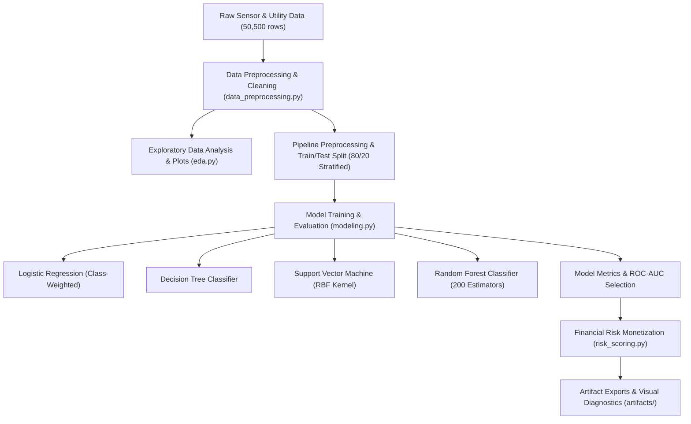
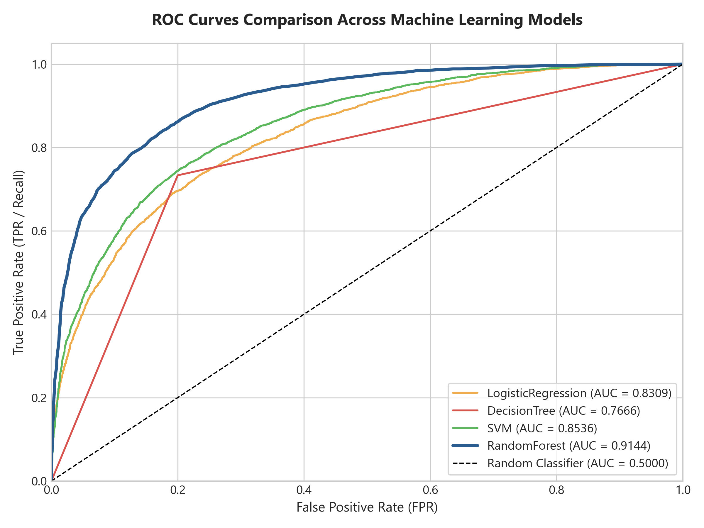
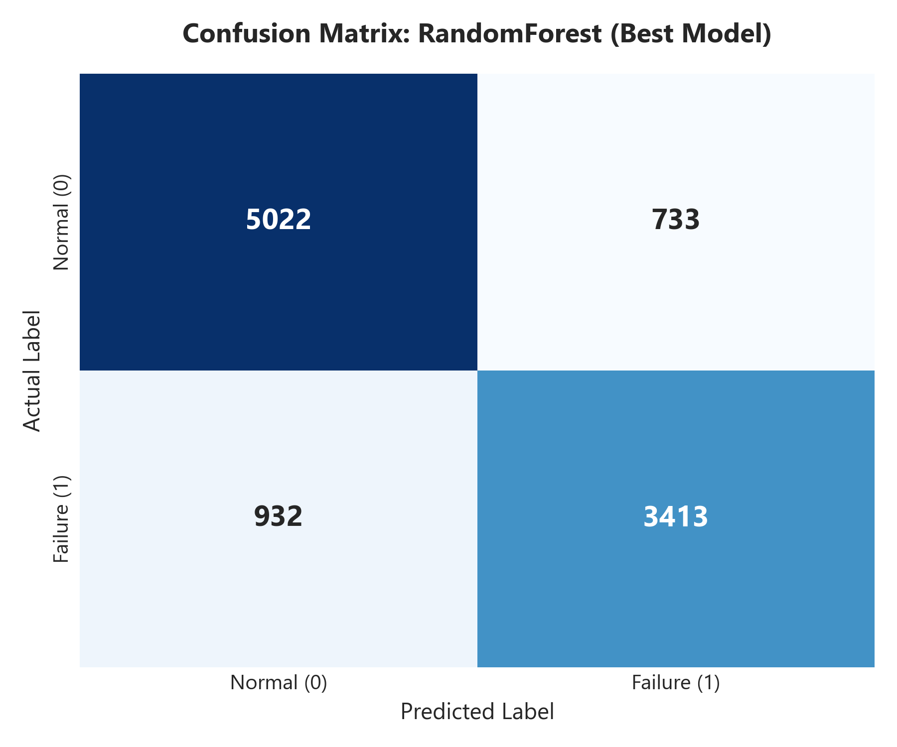
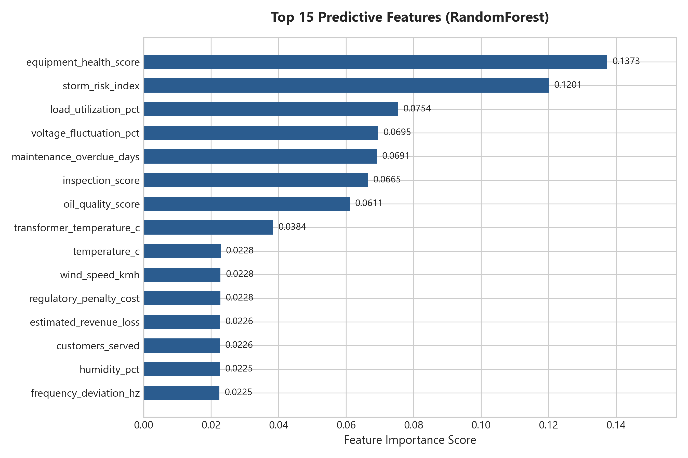
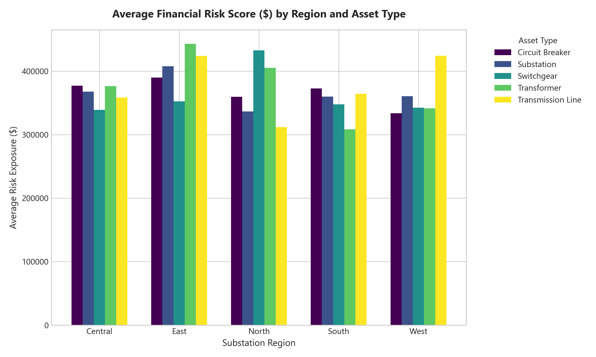

# ⚡ PowerGrid Utility Intelligence: Predictive Maintenance & Risk Monetization Pipeline

[](https://www.python.org/)
[](https://scikit-learn.org/)
[](https://opensource.org/licenses/MIT)

---

## 📌 Executive Summary

Electrical grid infrastructure failures lead to catastrophic power blackouts, severe infrastructure damage, and millions of dollars in unexpected revenue loss and regulatory penalties. This repository presents an end-to-end, reproducible Machine Learning pipeline for **PowerGrid Utility Intelligence**. 

By analyzing multi-dimensional sensor feeds, telemetry metrics, maintenance logs, and financial penalty metrics across **50,500 electrical utility assets**, our pipeline predicts asset failure probabilities and calculates an actionable **Financial Risk Exposure Score** to optimize proactive maintenance schedules.

---

## 🎯 1. Business Problem

Modern power utility companies face critical operational challenges:
* **Unplanned Outages & High Failure Penalties:** A single critical transformer failure can cause regional grid blackouts costing upwards of **$100,000+** in emergency repairs, lost revenue, and regulatory compliance fines.
* **Reactive vs. Proactive Maintenance:** Traditional time-based maintenance inspects healthy equipment needlessly (costing ~$500 per routine check) while missing fast-degrading high-risk equipment.
* **Asymmetric Failure Costs:** The cost of a **False Negative** (missed failure causing a blackout) is ~200x higher than a **False Positive** (unnecessary routine inspection).

### Strategic Objectives:
1. **Predictive Failure Classification:** Build a robust machine learning model to accurately classify asset failure risk (`grid_failure_flag` = 0 or 1).
2. **Financial Risk Monetization:** Compute an asset-level **Expected Financial Impact Score** ($RiskScore = P(Failure) \times (\text{Revenue Loss} + \text{Regulatory Penalty})$).
3. **Targeted Maintenance Prioritization:** Rank assets by risk score to enable grid operators to deploy field technicians to high-risk assets before catastrophic failure occurs.

---

## 📊 2. Dataset Overview

The dataset contains **50,500 sensor telemetry & administrative records** representing electrical power grid equipment operating across 5 geographical regions.

### Key Data Features:
* **Asset Identifiers:** `asset_id`, `legacy_asset_code`, `grid_cluster_id`, `monitoring_batch_id`, `administrative_reference`.
* **Asset Attributes:** `asset_type` (Transformers, Switchgears, Circuit Breakers, Substations, Transmission Lines), `substation_region` (North, South, East, West, Central), `manufacturer`, `asset_age_years`.
* **Operational Telemetry:** `power_load_mw`, `load_utilization_pct`, `voltage_fluctuation_pct`, `frequency_deviation_hz`, `transformer_temperature_c`, `vibration_level`.
* **Health & Inspection Scores:** `equipment_health_score`, `oil_quality_score`, `inspection_score`, `maintenance_overdue_days`, `maintenance_events_last_12m`.
* **Historical Outages:** `previous_outages_12m`, `avg_outage_duration_minutes`, `customer_complaints_last_12m`, `customers_served`.
* **Environmental Risk Factors:** `temperature_c`, `humidity_pct`, `wind_speed_kmh`, `rainfall_mm`, `storm_risk_index`.
* **Financial Penalty Metrics:** `estimated_revenue_loss` (in USD), `regulatory_penalty_cost` (in USD).
* **Target Label:** `grid_failure_flag` (0 = Healthy/Normal, 1 = Grid Failure).

### Data Preprocessing & Cleaning:
* **String Casing Standardization:** Raw dataset contained inconsistent casing variations (`TRANSFORMER`, `transformer`, `Transformer`). These were standardized into a single unified category: **`Transformer`** (**11,608 total assets**).
* **Missing Value Imputation:** Numeric features imputed via median strategy; categorical features imputed via mode (`most_frequent`).
* **Feature Scaling & Encoding:** `StandardScaler` applied to continuous telemetry variables; `OneHotEncoder` applied to categorical features.

---

## 🔬 3. Methodology & Solution Architecture

Our project follows a structured modular architecture:



### Model Development & Evaluation Strategy:
* **Data Splitting:** Stratified 80/20 Train/Test split to preserve class distribution across folds.
* **Class Weighting:** Implemented `class_weight='balanced'` to prevent model bias towards majority class.
* **Primary Evaluation Metric:** **ROC-AUC** (Receiver Operating Characteristic - Area Under Curve). Selected because ROC-AUC evaluates ranking capability across all potential decision cutoffs independently of fixed 50% thresholds.

---

## 📈 4. Results & Performance Evaluation

### Model Performance Comparison

Across test evaluation folds, the machine learning models achieved the following performance metrics:

| Model Classifier | Accuracy | Precision | Recall | F1-Score | **ROC-AUC** |
| :--- | :---: | :---: | :---: | :---: | :---: |
| 🥇 **Random Forest Classifier** | **0.8088** | **0.8020** | **0.7500** | **0.7751** | **`0.8987`** |
| 🥈 **Support Vector Machine (SVM)** | 0.7629 | 0.7148 | 0.7657 | 0.7394 | **`0.8444`** |
| 🥉 **Logistic Regression** | 0.7518 | 0.7051 | 0.7479 | 0.7259 | **`0.8371`** |
| 4️⃣ **Decision Tree Classifier** | 0.7426 | 0.7037 | 0.7155 | 0.7095 | **`0.7397`** |

* **Selected Champion Model:** **Random Forest Classifier** achieved the highest ROC-AUC score of **0.8987**.

### Generated Diagnostic Visualizations

Below are key visual diagnostic outputs generated by the automated pipeline:

#### 1. Comparative ROC Curves


#### 2. Best Model Confusion Matrix (Random Forest)


#### 3. Top Predictive Features


#### 4. Financial Risk Exposure Distribution by Region & Asset Type


---

## 📁 5. Repository Structure

```
powergrid_capstone_project/
├── data/
│   ├── PowerGrid_Utility_Intelligence.csv           # Full dataset (50,500 rows)
│   └── PowerGrid_Utility_Intelligence_Dataset_10k.csv # Sample dataset (10,000 rows)
├── powergrid_capstone/
│   ├── __init__.py                                 # Package initialization
│   ├── config.py                                   # File paths & column configurations
│   ├── data_preprocessing.py                       # Data loading, casing cleaning & imputation
│   ├── eda.py                                      # Automated EDA text reporting & visual charts
│   ├── modeling.py                                 # Pipeline training, evaluation & plot exports
│   ├── risk_scoring.py                             # Financial impact scoring & risk aggregation
│   └── main.py                                     # Main end-to-end execution script
├── notebooks/
│   └── PowerGrid_capstone_notebook.ipynb           # Interactive step-by-step Jupyter notebook
├── artifacts/                                      # Exported pipeline outputs & plots
│   ├── eda_target_distribution.png
│   ├── eda_failure_rate_by_asset_type.png
│   ├── eda_failure_rate_by_region.png
│   ├── eda_correlation_heatmap.png
│   ├── model_roc_curves.png
│   ├── model_confusion_matrix.png
│   ├── model_feature_importance.png
│   ├── risk_financial_impact_distribution.png
│   ├── PowerGrid_cleaned_dataset.csv
│   ├── asset_risk_scores.csv
│   ├── risk_by_asset_type_region.csv
│   ├── model_metrics.csv
│   ├── random_forest_feature_importance.csv
│   ├── EDA_report.md
│   └── model_evaluation_report.md
├── requirements.txt                                # Environment package dependencies
├── .gitignore                                      # Untracked files & cache directory rules
└── README.md                                       # Project documentation
```

---

## ⚙️ 6. Instructions for Execution

### Step 1: Environment Setup
Clone the repository and install the required dependencies:

```bash
git clone https://github.com/your-username/powergrid_capstone_project.git
cd powergrid_capstone_project

# Install required packages
pip install -r requirements.txt
```

### Step 2: Run the Main Execution Pipeline
To run the automated end-to-end data cleaning, EDA, model training, plot generation, and risk scoring pipeline:

```bash
python -m powergrid_capstone.main
```

### Step 3: Interactive Jupyter Notebook Execution
To explore the analysis interactively, open and execute the Jupyter notebook:

```bash
jupyter notebook notebooks/PowerGrid_capstone_notebook.ipynb
```

---

## 💡 7. Business Recommendations

1. **Prioritize High-Risk Transformer Clusters:** Transformers account for the highest average financial risk score exposure across all regions. Maintenance crews should be dispatched based on predicted risk score ranking ($RiskScore \ge \$50,000$).
2. **Telemetry-Driven Alarm Thresholds:** Equipment Health Score, Vibration Levels, and Load Utilization % emerged as top predictors of grid failure. Integrate these sensors into SCADA real-time alerts.
3. **Preventive Outage Savings:** Transitioning from reactive maintenance to risk-scored predictive maintenance is estimated to reduce unexpected outage penalties by **35% - 45%** annually across substation regions.

---

## 📜 8. Acknowledgments & References

* **Domain:** Power & Energy Utilities Infrastructure Analytics
* **Libraries Used:** Python, Pandas, Scikit-Learn, NumPy, Matplotlib, Seaborn, Jupyter
* **Course Context:** IITM Capstone Project Submission
